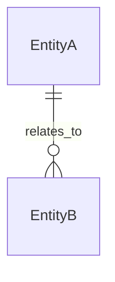

# ER Modeling Skill

> 用途：設計橋接階段（design）產出 **logical/specification-level ER model draft**，供 ATDD/TDD 對齊。
> 產出不是 migration script，也不是正式 ER Model 審查治理產物。


## 使用時機

- Gherkin 定稿、domain glossary、candidate entities、rules、examples 已就緒，功能涉及資料持久化。
- 使用者已提供脫敏後 DDL / schema 摘要 / ER 圖 / migration 片段需要詮釋時可提前使用。
- 無資料持久化時**不要產出 ER 圖** —— 在回傳裡說一句「無持久化，不需資料模型」即可。

## 輸入

- glossary、candidate model、business rules、examples。
- 脫敏後 DDL / migration 片段 / 資料表摘要 / 截圖 / ER 圖。
- 若已有 API contract draft，其 schemas。
- 資料來源策略與儲存假設。

## 指引

1. 從 domain 名詞與業務不變量出發，再設計資料表。
2. 辨識 entity、value object、aggregate root、read model。
3. 定義 identity、鍵屬性、required/nullable、約束。
4. 辨識關聯型別（association / composition / aggregation）與 cardinality（1:1 / 1:N / N:M）。
5. 每個多對多關係建立 junction entity/table。
6. 記錄 PK、FK、unique、check、default、index 提示。
7. 若 API 回應合併多個 entity 欄位，定義 read model/projection 與 join path。
8. 儲存技術未知時預設關聯式 ER model 並記錄 assumption。
9. schema 證據與業務語言衝突時列為 open question，不得擅自決定。
10. **不暴露**與業務無關的內部欄位名稱（與 DLP 交叉檢查）。

## Output Contract

````markdown
STATUS: needs-input | draft

## design/er-model.mmd


## design/data-dictionary.md
| Entity | Field | Type | Required | Key / Constraint / Index | Source / Rule | Notes |
| --- | --- | --- | --- | --- | --- | --- |

## Relationships
| Source | Target | Type | Cardinality | FK | Delete Policy | Notes |
| --- | --- | --- | --- | --- | --- | --- |

## Read Models
| Read Model | API / Use Case | Source Entities | Join Path | Fields |
| --- | --- | --- | --- | --- |

## Assumptions
- ...

## Open Questions
- ...

## Next Skill
建議下一步：交回 orchestrator 走 ③ 定案；契約有破壞性變更時，`reviewer`（`mode: spec`）必審
````

## Quality Gate

- `STATUS: needs-input`：核心 entity、identity 或必要關聯無法判定。
- `STATUS: draft`：ER model 可在明確 assumptions 下被審核，術語對齊 glossary。
